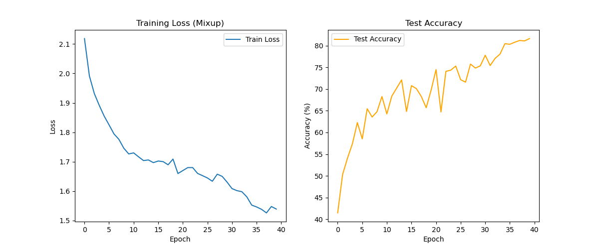

# 进阶训练技巧笔记 (Task 4)

在任务四中，为了进一步提升模型的泛化能力和训练稳定性，引入了两个核心技巧：**Warmup (学习率预热)** 和 **Mixup (混合增强)**。

## 1. Warmup (学习率预热)

### 核心思想
**“先慢后快”**。在训练初期使用较小的学习率，让模型参数逐渐适应数据分布，避免因初始梯度过大导致模型发散或陷入局部最优；待模型稳定后，再增大学习率加速收敛。

### 代码实现
使用了 PyTorch 的 `OneCycleLR` 调度器：
```python
# max_lr=0.1: 最大学习率
# epochs=40: 总训练轮数
scheduler = torch.optim.lr_scheduler.OneCycleLR(optimizer, max_lr=0.1, epochs=40, 
                                                steps_per_epoch=len(trainloader))
```
**效果**：学习率曲线呈现“抛物线”形状（先升后降），训练过程更加平滑。

## 2. Mixup (混合增强)

### 核心思想
**“线性插值”**。通过混合两张图片及其标签，构造出新的训练样本，强迫模型学习特征之间的线性过渡关系，而不是死记硬背离散的类别边界。

### 数学原理
$$ \tilde{x} = \lambda x_i + (1 - \lambda) x_j $$
$$ \tilde{y} = \lambda y_i + (1 - \lambda) y_j $$
其中 $\lambda \sim Beta(\alpha, \alpha)$。

### 代码实现
```python
def mixup_data(x, y, alpha=1.0):
    '''Returns mixed inputs, pairs of targets, and lambda'''
    if alpha > 0:
        lam = np.random.beta(alpha, alpha)
    else:
        lam = 1
    batch_size = x.size(0)
    index = torch.randperm(batch_size).to(device)
    mixed_x = lam * x + (1 - lam) * x[index, :]
    y_a, y_b = y, y[index]
    return mixed_x, y_a, y_b, lam
```

### 优势
1.  **正则化效果**：相当于无限扩充了数据集，有效防止过拟合。
2.  **鲁棒性增强**：模型对对抗样本和模糊图像的识别能力更强。
3.  **平滑决策边界**：类别之间的过渡更加自然，减少了模型“过度自信”的错误预测。
## 实验结果更新
最终使用了 Mixup + Warmup + OneCycleLR 策略。
- **最佳测试准确率**：83.57%
- **训练曲线**：


### 结果分析
可以看到在 Epoch 30 之后，随着学习率下降，准确率出现了显著的提升（退火效应）...
