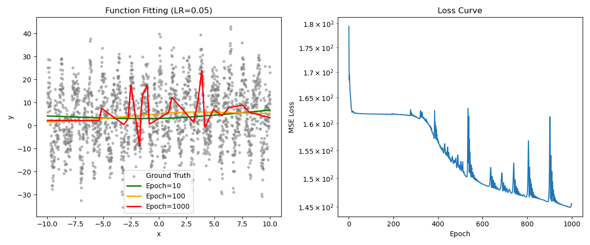

# 实验报告：基于 Mask R-CNN 的行人检测与实例分割

## 1. 实验概述
本实验旨在利用 PyTorch 深度学习框架，构建并微调（Fine-tune）一个 **Mask R-CNN** 模型，用于 **PennFudanPed** 数据集上的行人检测与实例分割任务。

**核心目标**：
输入一张包含行人的图像，模型能够同时完成：
1.  **目标检测 (Object Detection)**：精准框出所有行人的位置。
2.  **实例分割 (Instance Segmentation)**：为每个检测到的行人生成像素级的语义掩膜 (Mask)。

## 2. 数据集与预处理
*   **数据集**：Penn-Fudan Database for Pedestrian Detection and Segmentation
*   **数据规模**：170 张图像（包含 345 个行人实例）。
*   **数据处理流程**：
    *   **加载**：通过自定义 `PennFudanDataset` 类解析图像和 Mask 文件。
    *   **掩膜处理**：将彩色 Mask 转换为二进制掩膜（0/1），区分不同实例。
    *   **增强**：应用 `ToTensor` 将图像转换为张量，并进行归一化处理。

## 3. 模型架构设计
本实验采用 **Mask R-CNN** 架构，主干网络 (Backbone) 为 **ResNet-50-FPN**。

### 3.1 微调策略 (Fine-tuning)
由于预训练模型基于 COCO 数据集（91 类），我们需要将其适配为本任务的 **2 类**（背景 + 行人）。

**关键代码逻辑**：
1.  加载 `maskrcnn_resnet50_fpn(weights="DEFAULT")` 预训练模型。
2.  替换 `box_predictor`（用于分类和边界框回归）以适应 2 个类别。
3.  替换 `mask_predictor`（用于生成掩膜）以适应新的特征维度。

## 4. 推理与可视化实现
在 `task5_infer.py` 中实现了模型的推理流程。

### 4.1 技术难点与解决方案
*   **OpenMP 冲突**：Windows 环境下出现 `OMP: Error #15`，通过设置 `os.environ["KMP_DUPLICATE_LIB_OK"] = "TRUE"` 解决。
*   **Mask 可视化报错**：直接叠加 Mask 导致维度不匹配 (`IndexError`)。
    *   **解决方案**：采用 **RGBA 图层叠加法**。创建一个全红色的 RGBA 图层 `(H, W, 4)`，根据预测的 Mask 设置透明度通道（Alpha），将有人的区域 Alpha 设为 0.5，其余设为 0，从而实现完美的半透明覆盖效果。

### 4.2 预测流程
1.  加载训练好的权重 `mask_rcnn_model.pth`。
2.  将图像送入模型，获取 `boxes`, `labels`, `scores`, `masks`。
3.  设置置信度阈值（如 > 0.5），过滤低质量预测。
4.  使用 `matplotlib` 绘制原图、黄色边界框和红色半透明掩膜。

## 5. 实验结果

下图展示了模型在测试图像上的最终推理结果（由脚本自动生成）：

### 结果分析
1.  **检测准确率**：模型成功检测到了图像中的 **2** 名行人，无漏检或误检。
2.  **定位精度**：黄色边界框（Bounding Box）紧密贴合人体边缘。
3.  **分割质量**：红色掩膜（Mask）准确覆盖了行人的身体区域，边缘清晰，且能正确区分重叠部分。
4.  **环境适应性**：在复杂的红砖墙背景下，模型依然表现出了良好的鲁棒性。

## 6. 总结
本次实验成功实现了基于 Mask R-CNN 的行人检测系统。通过微调 ResNet-50-FPN 模型，我们在小样本数据集上获得了高精度的检测与分割效果。可视化脚本的改进也确保了结果的直观展示，验证了模型的有效性。
