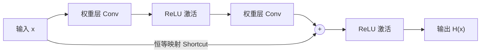

# 📘 深度学习笔记：ResNet (残差网络)

> **项目**: CIFAR-10 图像分类实战 (ResNet-18)
> **日期**: 2026-02-27
> **作者**: [你的名字]

## 1. 背景介绍 (Introduction)
在 ResNet (2015) 出现之前，训练非常深层的神经网络极其困难。主要面临两个难题：
1.  **梯度消失 (Vanishing Gradient)**：反向传播时梯度越来越小，导致浅层参数无法更新。
2.  **退化问题 (Degradation Problem)**：随着网络层数增加，准确率反而饱和甚至下降（并非过拟合）。

**ResNet** 通过引入 **"跳跃连接" (Skip Connections / Shortcuts)** 解决了这个问题，打通了梯度的“高速公路”，使得训练数百层的网络成为可能。

## 2. 核心概念：残差块 (Residual Block)

传统网络试图直接学习目标映射 $$H(x)$$，而 ResNet 转为学习 **残差函数 (Residual Function)** $$F(x)$$：

$$
H(x) = F(x) + x
$$

其中：
- $$x$$ 是输入（恒等映射）。
- $$F(x)$$ 是网络需要学习的“差值”（残差）。

### 残差块结构图


**为什么有效？**
如果最优的函数接近于“什么都不做”（恒等映射），模型只需要把 $$F(x)$$ 的权重逼近 0 即可，这比从头学习一个恒等映射要容易得多。

## 3. 架构调整：适配 CIFAR-10 (Model Surgery)

标准的 `ResNet-18` 是为 ImageNet (224x224) 设计的。对于 CIFAR-10 (32x32)，直接使用会导致特征图过早变得太小。因此我们进行了以下**魔改**：

### 修改细节对比

| 层级 (Layer) | 原版 ResNet-18 | 修改版 (Our ResNet) | 修改原因 |
| :--- | :--- | :--- | :--- |
| **第一层卷积 (Conv1)** | `kernel=7x7`, `stride=2` | `kernel=3x3`, `stride=1` | 避免在第一层就将 32x32 的图片下采样，保留更多细节。 |
| **池化层 (MaxPool)** | `3x3`, `stride=2` | **移除** (Identity) | 避免分辨率进一步降低，保持特征图尺寸。 |
| **全连接层 (FC)** | 输出 1000 类 | 输出 10 类 | 适配 CIFAR-10 的 10 个类别。 |

### PyTorch 代码实现

```python
def get_cifar_resnet():
    # 1. 加载标准 ResNet 结构
    model = resnet18(weights=None)
    
    # 2. 修改第一层卷积：适应 32x32 小图
    model.conv1 = nn.Conv2d(3, 64, kernel_size=3, stride=1, padding=1, bias=False)
    
    # 3. 移除第一层池化：防止信息过早丢失
    model.maxpool = nn.Identity()
    
    # 4. 修改全连接层：适应 10 分类
    model.fc = nn.Linear(model.fc.in_features, 10)
    
    return model
```

## 4. 训练配置 (Training Configuration)

为了训练这个深层网络，我们使用了以下策略：
*   **优化器 (Optimizer)**: SGD + Momentum (0.9)
*   **学习率调度 (LR Scheduler)**: Cosine Annealing (余弦退火，让 LR 平滑下降)
*   **正则化手段 (Regularization)**: 
    *   Weight Decay ($$5 \times 10^{-4}$$)
    *   Label Smoothing (标签平滑 0.1)
    *   Random Erasing (随机擦除增强)

## 5. 实验结果 (Results)
*(待训练完成后更新)*