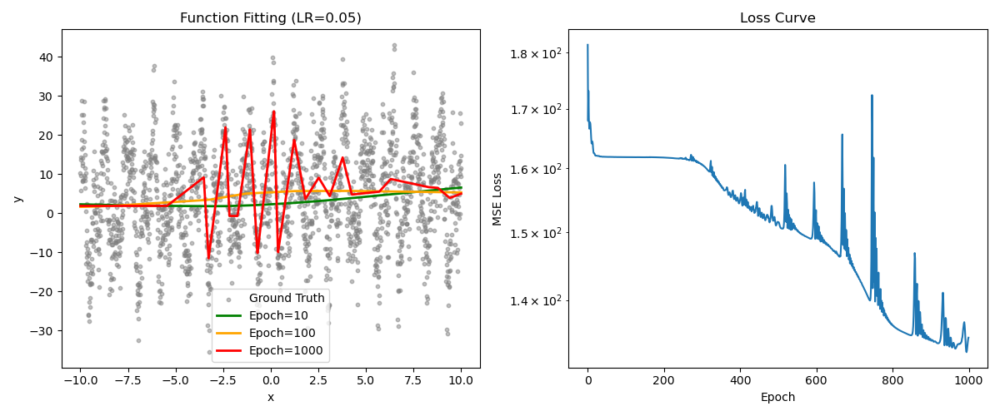
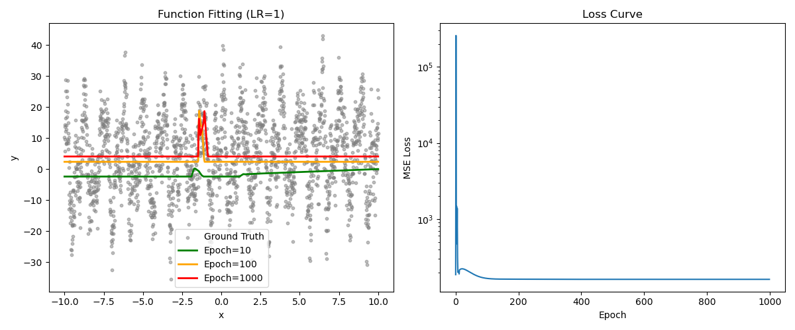
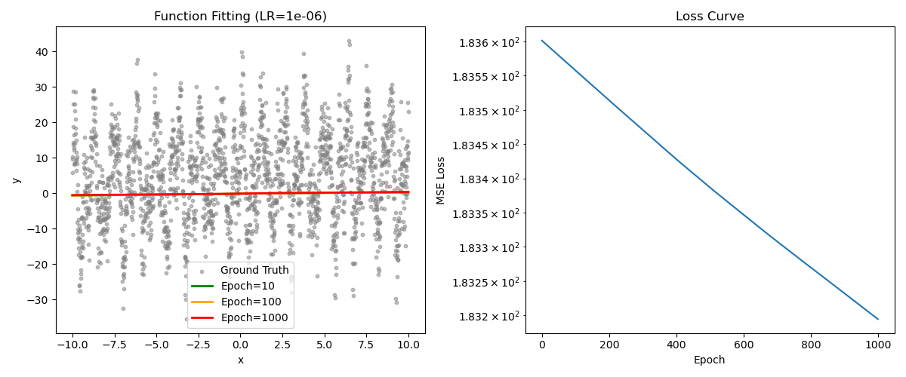

# 任务二报告：神经网络拟合实验与学习率分析

## 实验概述
这个实验是我第一次尝试用神经网络去拟合数据，感觉挺新奇的。任务是用一个简单的全连接神经网络（MLP）去拟合从 `data.csv` 里读取的数据，然后研究学习率（Learning Rate, LR）对训练效果的影响。实验用的是 PyTorch 框架，损失函数是均方误差（MSE Loss），优化器用的是 Adam。训练一共跑了 1000 个 Epoch，隐藏层有 20 个神经元。

我测试了三种学习率：
- **LR = 0.05**（作为基准）
- **LR = 1.0**（感觉很大）
- **LR = 0.000001 (1e-06)**（非常小）

下面是我对实验结果的记录和分析，主要是看学习率对 Loss 曲线和拟合效果的影响。

---

## 实验结果与记录

### 1. 学习率 = 0.05（基准值）
- **Loss 变化**：
  - 一开始 Loss 大概是 1.8 x 10²，训练到最后降到了 1.4 x 10² 左右。
  - 从终端日志看，Loss 从 Epoch 10 的 164.644180 降到 Epoch 1000 的 143.882126（有一次跑出来是 134.756882）。
  - 在对数坐标的图上，Loss 曲线是慢慢往下走的，感觉模型在逐步学到东西。
- **拟合效果**：
  - Epoch=10 的时候，预测的曲线跟真实数据（Ground Truth）差得挺远。
  - 到了 Epoch=100 和 Epoch=1000，预测曲线越来越贴近真实数据点，拟合看起来好多了。
- **我的想法**：
  - 学习率 0.05 好像还不错，模型能在 1000 轮内学到一些数据的规律，Loss 下降得挺明显，拟合效果也还可以。
- **图表**：
  

### 2. 学习率 = 1.0（很大）
- **Loss 变化**：
  - Loss 值特别高，一直在 10³ 到 10⁵ 之间晃荡，完全没怎么下降。
  - 终端日志显示 Loss 从 Epoch 10 的 199.256317 到 Epoch 1000 的 161.396347，虽然有点下降，但还是很高，而且波动很大。
  - 在对数坐标图上，曲线乱七八糟地上下跳，完全不像在收敛。
- **拟合效果**：
  - 预测曲线从 Epoch=10 到 Epoch=1000 都完全偏离真实数据，看起来毫无规律。
  - 训练到最后也没能贴近数据点，拟合效果很差。
- **我的想法**：
  - 学习率 1.0 太大了，模型好像完全学不到东西，训练过程很不稳定。我猜是因为每次更新参数时步子迈得太大，直接跳过了正确的方向。
- **图表**：
  

### 3. 学习率 = 0.000001 (1e-06)（很小）
- **Loss 变化**：
  - Loss 值几乎没动，从一开始的 1.836 x 10² 就降了一点点到 1.832 x 10²。
  - 终端日志显示 Loss 从 Epoch 10 的 183.597473 到 Epoch 1000 的 183.194427，变化很小。
  - 在对数坐标图上，Loss 曲线几乎就是一条平线，感觉模型没怎么学到东西。
- **拟合效果**：
  - 预测曲线从 Epoch=10 到 Epoch=1000 几乎没变，一直跟真实数据差很远。
  - 训练到最后，曲线还是像刚开始随机猜的那样，拟合效果很差。
- **我的想法**：
  - 学习率 0.000001 太小了，每次参数更新都只有一点点变化，1000 轮根本不够让模型学到数据的规律。
- **图表**：
  

---

## 学习率的影响分析

**问题**：当学习率调得特别大（比如 1.0）或者特别小（比如 0.000001）时，Loss 曲线有什么变化？为什么会这样？

**我的理解**：
- **学习率很大（LR = 1.0）**：
  - **Loss 曲线变化**：Loss 一直在高值波动，甚至不降反升（从 199.256317 到 161.396347，还是很高）。对数图上曲线乱跳，完全不收敛。
  - **原因**：我一开始不太懂，后来查了资料，觉得是因为学习率太大，每次更新参数时步子太大，容易直接跳过最好的解，甚至让参数变得不合理，Loss 可能会很大或者不稳定。虽然用了 Adam 优化器，但好像还是解决不了这么大学习率的问题。
- **学习率很小（LR = 0.000001）**：
  - **Loss 曲线变化**：Loss 几乎不变，从 1.836 x 10² 就降了一点点到 1.832 x 10²（从 183.597473 到 183.194427）。对数图上就是一条平线，模型没啥进步。
  - **原因**：学习率太小，每次参数调整都很小，1000 轮训练根本不够让模型学到东西。感觉就像走路步子太小，半天走不到目的地。
- **背后原理**：
  - 我理解的优化过程就像在山上找最低点，学习率就像每次迈的步子。步子太大（LR=1.0）容易跳过谷底，步子太小（LR=1e-06）走得太慢，到不了谷底。
  - 实验用的损失函数是均方误差（MSE Loss），公式是：
    $$ \text{Loss} = \frac{1}{n} \sum_{i=1}^n (y_i - \hat{y}_i)^2 $$
    其中 $$y_i$$ 是真实值，$$\hat{y}_i$$ 是预测值。学习率会影响预测值更新的速度和方向。

---

## 总结和反思
- **总结**：
  - 学习率对训练效果影响很大。像 0.05 这样的值效果还不错，Loss 会慢慢下降，模型也能学到数据的样子。太大的学习率（1.0）让训练乱七八糟，太小的学习率（1e-06）让模型几乎不进步。
- **反思**：
  - 这次实验让我第一次感受到学习率的重要性。刚开始调参数的时候完全是凭感觉，后来发现不合适的参数会让模型完全学不到东西。以后我想多试试不同学习率，比如 0.01 或者 0.1，看看能不能更快学好。
  - 还有，1000 轮可能不够，尤其是学习率小的时候。以后可以多跑几轮，或者试试自动调整学习率的方法（好像 PyTorch 里有 `lr_scheduler`）。
  - 隐藏层神经元数量（20 个）是不是也影响效果？我想下次改改这个值试试看。
