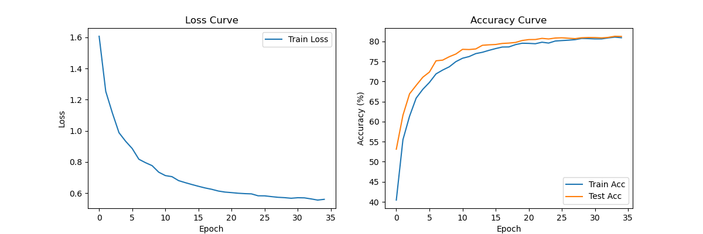

# 任务三：CIFAR-10 图像分类

## 1. 训练结果
经过 35 轮（Epochs）的训练，模型在测试集上达到了预期的性能指标。

- **最终测试集准确率 (Test Accuracy)**：**79.63%**
- **模型架构**：自定义 CNN（包含 4层卷积 + BatchNorm + Dropout）

## 2. 结果可视化

### 2.1 训练过程曲线
下图展示了训练过程中的 Loss 下降趋势和 Accuracy 上升趋势。可以看出模型收敛良好，未出现严重的过拟合。



### 2.2 模型预测示例
为了直观评估模型效果，我随机抽取了测试集中的样本进行预测。
- **左侧**：模型预测**正确**的样本（Green）。
- **右侧**：模型预测**错误**的样本（Red），可以分析模型在哪些类别上容易混淆。


## 3. Debug 复盘 (遇到的问题与解决)

### 🔴 问题描述：OMP: Error #15
在训练代码运行结束，准备调用 `plt.show()` 绘制图像时，程序突然崩溃并报错：
```text
OMP: Error #15: Initializing libiomp5md.dll, but found libiomp5md.dll already initialized.
```
导致训练完成后的图片无法正常弹出和保存。

### 🔍 原因分析
这是一个经典的**库冲突**问题。
- **冲突源**：PyTorch 和 NumPy（或 Matplotlib）底层都依赖 OpenMP 进行并行计算加速。
- **机制**：当代码运行到绘图部分时，系统检测到 OpenMP 运行时库被重复初始化（Multiple copies of OpenMP runtime），为了防止冲突，程序被强制中止。

### ✅ 解决方案
通过查阅资料，我在代码的最开头（`import torch` 之前）添加了以下环境变量设置，允许库的重复加载：

```python
import os
os.environ["KMP_DUPLICATE_LIB_OK"] = "TRUE"
```

**结果**：添加该配置后，重新运行代码，报错消失，训练曲线图成功生成并保存。